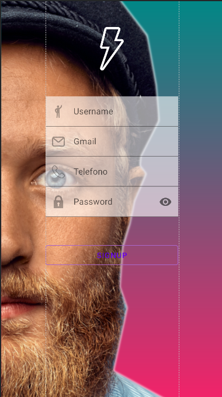
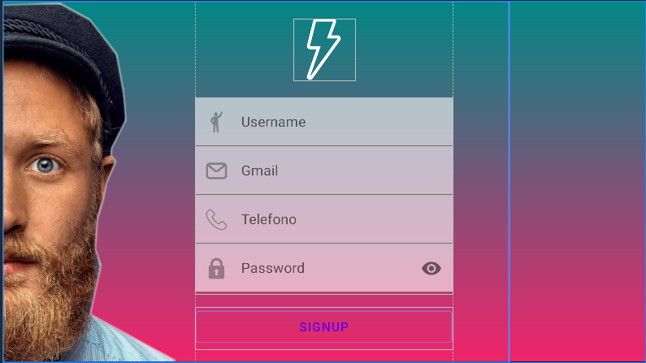
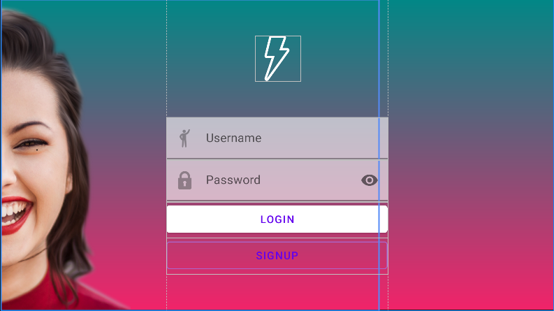
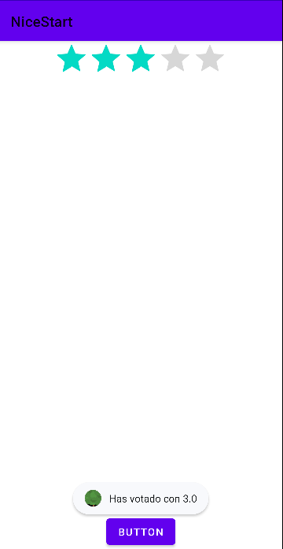
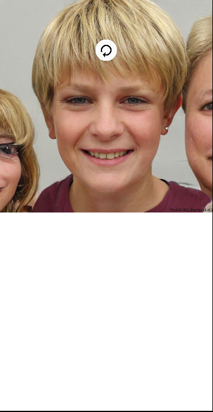

## Nicestart

Esto es una aplicación que contiene una vista de login y otra de register.
Ademas estas estan interconectadas entre si y con una vista main.

Cuando iniciamos la aplicación tenemos una vista de splash en la que hemos añadido una animación de tipo blink.

Una vez haya cargado la aplicación accedemos a la pantalla del login.

En caso de no tener una cuenta, el boton de signup esta enlazado con la vista donde habria que registrarse para poder acceder a la app.
Aqui vemos la vista register.

La vista login y register estan disponibles tambien en vision landscape.

Estas capturas son las versiones anteriores a la aplicación.

Una vez ya tengas cuenta y te hayas logeado en la aplicación nos dirigimos a la vista Main, en la que hemos puesto una barra de valoración de la APP.
Una vez valorada la App saldra una mensaje con la puntuación dada.

En un futuro utilizaremos el boton introducido en la parte inferior de la pantalla, el cual nos mostrara en un popUp la barra de valoracion.

También tenemos añadida una vista en la cual tiene introducido un SwipeRefresh, el cual cada vez que recargamos la página nos saldra una imagen distina.

Hemos realizado mi compañera Carlota y yo un PullRequest uno a cada uno introduciendo un cambio en su programa.
En mi caso le he [añadido](https://github.com/Nachiitoo3/AroundGitFinal/network) un activity en el que hay incluido una barra de puntuación.
Y ella [incluyó](https://github.com/CarlotaCordero/NiceStart/network) un animacion en mi carpeta anim.

La aplicación sigue en desarrollo, iremos actualizando cada semana.